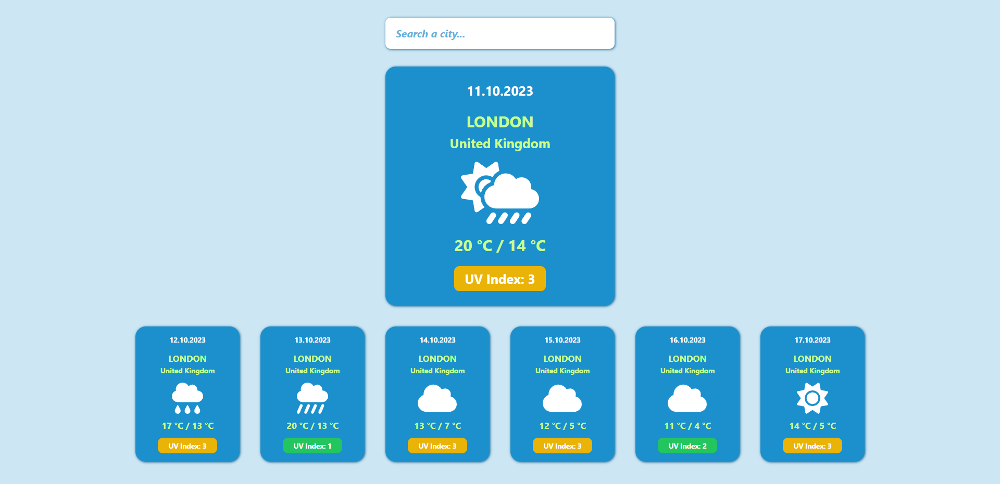

# MeteoForecast - React TypeScript Weather App

Responsive weather app made with React and TypeScript. Displays a weather info for a searched city.

App is also deployed on Netlify: https://meteoforecast.netlify.app

## Built with

-   HTML
-   CSS
-   JavaScript / TypeScript
-   React

## Installation and Setup

This app was created using Vite: https://vitejs.dev

-   Clone repository
-   Install: `npm install`
-   Run: `npm run dev`
-   Open http://localhost:5173 to view the app in the browser

## Description and Usage

-   App is fetching data from Open-Meteo API: https://open-meteo.com
-   When you type a city name in a search bar a dropdown menu will appear with fetched results
-   After you select a city, app will display weather info for the selected city
-   City is saved in local storage and will display again after page reloads

## License

MIT License. See `LICENSE.txt` for more information.
